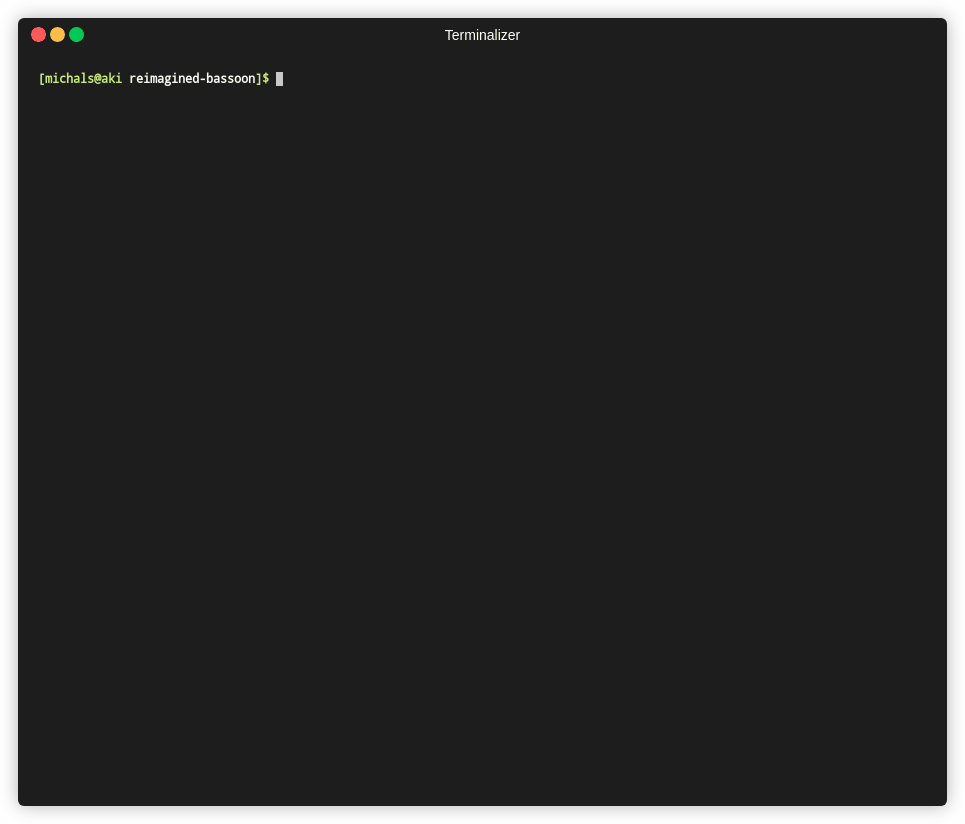

# nodetasks

A simple CLI for listing and executing npm tasks.

## Installation

```bash
$ pip install nodetasks
```

## Usage



## Todo

:black_square_button: Give user ability to run tasks with yarn
